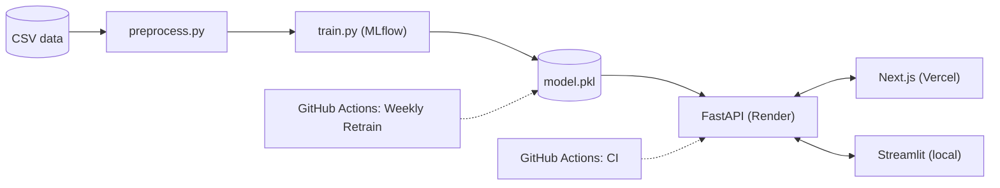
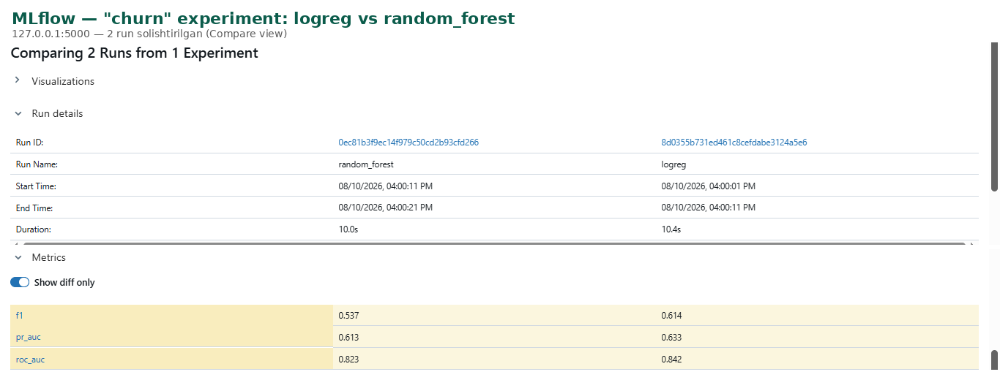
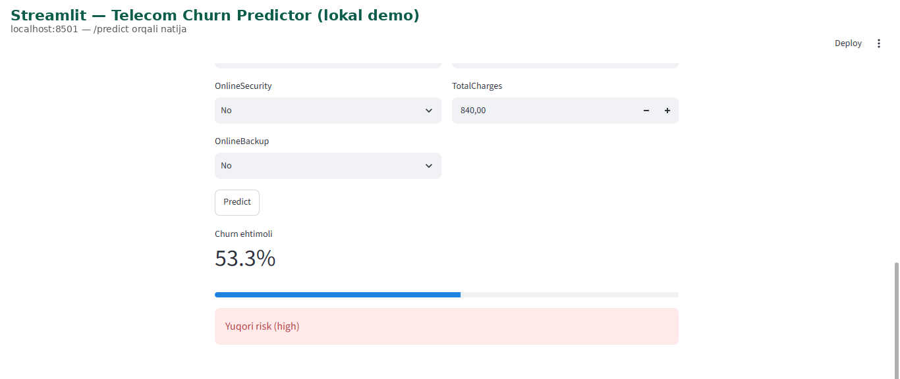
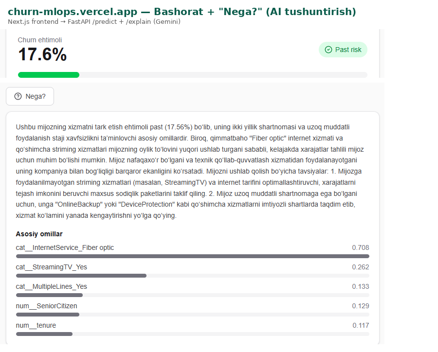

# Telecom Churn MLOps

[](https://github.com/amuminov337-pro/churn-mlops/actions/workflows/ci.yml)


End-to-end MLOps pipeline that predicts telecom customer churn and explains *why* — from a raw CSV to a scored, explainable prediction served in production.

## What is this

Telecom companies typically find out a customer is about to leave only after they've already left — retention offers arrive too late, if at all. This project trains a churn model on historical customer data, serves it as a REST API with a quality gate enforced in CI, and layers an AI explanation endpoint on top so that a probability score comes with the *reasons* behind it (top model drivers) and concrete retention suggestions, in plain language.

## Architecture



## Results

| Model | ROC-AUC | PR-AUC | F1 |
|---|---|---|---|
| **LogisticRegression** (`class_weight="balanced"`, selected) | **0.8416** | **0.6327** | **0.6136** |
| RandomForestClassifier | ≈ 0.8227 | — | — |

- sklearn `1.5.2` · last trained `2026-08-10`
- Both candidates are trained on the same split every run; the one with the higher ROC-AUC is selected, and a CI quality gate (`ROC_AUC_GATE = 0.83` in `src/train.py`) blocks a model from being saved/deployed if it doesn't clear the bar.

## Dataset

[IBM Telco Customer Churn](https://raw.githubusercontent.com/IBM/telco-customer-churn-on-icp4d/master/data/Telco-Customer-Churn.csv) — 7,043 rows, 21 columns, 26.54% churn rate.

## Running locally

```powershell
git clone https://github.com/amuminov337-pro/churn-mlops.git
cd churn-mlops
```

```powershell
py -3.11 -m venv venv
venv\Scripts\activate
```

```powershell
pip install -r requirements-dev.txt
```

```powershell
python src/train.py
```

```powershell
pytest -v
```

```powershell
uvicorn main:app --app-dir api --reload
```

```powershell
# optional: interactive dashboard
streamlit run dashboard.py
```

```powershell
# optional: frontend
cd frontend
npm install
npm run dev
```

## Deploy

- **Render** (Docker runtime) — root directory: repo root. Render builds the `Dockerfile` directly; no local `docker build` is needed or used.
- **Vercel** — Root Directory: `frontend`.

Environment variables (names only — values are never committed):

| Variable | Platform | Notes |
|---|---|---|
| `MODEL_PATH` | Render | `/app/models/model.pkl` |
| `ALLOWED_ORIGINS` | Render | comma-separated frontend origin(s) |
| `CHURN_THRESHOLD` | Render | `0.5` (default) |
| `NEXT_PUBLIC_API_URL` | Vercel | Render backend URL |
| `GEMINI_PROXY_API_KEY` / `GEMINI_PROXY_BASE_URL` / `GEMINI_MODEL` | Render (optional, AI explain layer) | *your secret value* |
| `GOOGLE_API_KEY` | Render (optional, AI explain fallback) | *your secret value* |
| `LANGFUSE_SECRET_KEY` / `LANGFUSE_PUBLIC_KEY` / `LANGFUSE_HOST` | Render (optional, tracing) | *your secret value* |

## Live

- Backend: [churn-mlops-maeh.onrender.com](https://churn-mlops-maeh.onrender.com) ([`/health`](https://churn-mlops-maeh.onrender.com/health), [`/docs`](https://churn-mlops-maeh.onrender.com/docs))
- Frontend: [churn-mlops.vercel.app](https://churn-mlops.vercel.app)

> Render's free tier sleeps after 15 minutes of inactivity — the first request after a sleep can take up to ~50 seconds to wake it up. The frontend handles this automatically with a "server waking up" state, so no action is needed.

## API examples

`POST /predict`:

```powershell
$body = @{
    gender = "Female"
    SeniorCitizen = 0
    Partner = "No"
    Dependents = "No"
    tenure = 5
    PhoneService = "Yes"
    MultipleLines = "No"
    InternetService = "Fiber optic"
    OnlineSecurity = "No"
    OnlineBackup = "No"
    DeviceProtection = "No"
    TechSupport = "No"
    StreamingTV = "No"
    StreamingMovies = "No"
    Contract = "Month-to-month"
    PaperlessBilling = "Yes"
    PaymentMethod = "Electronic check"
    MonthlyCharges = 89.9
    TotalCharges = 450.5
} | ConvertTo-Json

Invoke-RestMethod -Uri "https://churn-mlops-maeh.onrender.com/predict" -Method Post -Body $body -ContentType "application/json"
```

```json
{
  "churn_probability": 0.73,
  "will_churn": true,
  "risk": "high",
  "threshold": 0.5,
  "model_version": "model.pkl"
}
```

`POST /explain` (same `$body` as above):

```powershell
Invoke-RestMethod -Uri "https://churn-mlops-maeh.onrender.com/explain" -Method Post -Body $body -ContentType "application/json"
```

```json
{
  "explanation": "Ushbu mijozning ketish ehtimoli yuqori xavf darajasiga to'g'ri keladi. Asosiy omillar: qisqa muddatli shartnoma, past tenure va TechSupport xizmatining yo'qligi. Tavsiyalar: (1) yillik shartnomaga o'tishni chegirma bilan taklif qiling; (2) TechSupport xizmatini bepul sinov muddati bilan taqdim eting.",
  "source": "llm",
  "top_drivers": [
    { "feature": "cat__Contract_Month-to-month", "impact": 0.66 },
    { "feature": "num__tenure", "impact": 0.48 },
    { "feature": "cat__TechSupport_No", "impact": 0.31 }
  ],
  "churn_probability": 0.73,
  "risk": "high"
}
```

`explanation` is generated in Uzbek (the target audience for this demo) — this is the actual behavior of the deployed API, not a translation artifact.

## Senior concepts

- **Class imbalance** — churn is 26.54% of the dataset, so both models are trained with `class_weight="balanced"`, and model selection/gating uses ROC-AUC and PR-AUC rather than plain accuracy, which would be misleadingly high on an imbalanced target.
- **Preventing train/serve skew** — `src/preprocess.py` is the single transformation pipeline used both at training time (`src/train.py`) and at inference time (baked into the saved `model.pkl` `Pipeline`), so there's no separate serving-side preprocessing to drift out of sync. `tests/test_pipeline.py::test_no_train_serve_skew` asserts the preprocessed feature columns match the API's `Customer` schema fields on every CI run.
- **Experiment tracking** — every training run logs params, metrics, and the model artifact to MLflow for both candidates (`logreg` vs `random_forest`), making it possible to compare runs and reproduce the winning one.
- **CI quality gate** — `.github/workflows/ci.yml` runs `pytest` and `ruff` on every push/PR; `src/train.py` itself refuses to save or promote a model whose ROC-AUC falls below `0.83`, so a regression can't silently reach production.
- **Automated retraining** — `.github/workflows/retrain.yml` retrains the model on a weekly schedule (and supports manual `workflow_dispatch` runs), re-applying the same quality gate before committing an updated `model.pkl`.
- **Graceful degradation** — `POST /explain` never returns a 500 due to the AI layer: it tries a primary LLM proxy, falls back to a secondary provider, and finally falls back to a deterministic template response if both are unavailable or misconfigured.

## Screenshots


*Comparing the `logreg` and `random_forest` MLflow runs side by side.*


*Interactive local dashboard for exploring predictions.*


*The deployed frontend's "Nega?" (Why?) button showing an AI-generated explanation and top drivers.*

## Project structure

```
churn-mlops/
├─ api/
│  ├─ main.py          # FastAPI app (/health, /predict, /predict/batch)
│  ├─ explain.py        # /explain endpoint (LLM + template fallback)
│  └─ schema.py          # Pydantic request/response schemas
├─ src/
│  ├─ preprocess.py       # shared train/serve preprocessing pipeline
│  └─ train.py              # training, MLflow logging, quality gate
├─ tests/
│  └─ test_pipeline.py       # preprocess/train/api consistency tests
├─ frontend/
│  ├─ app/                    # Next.js pages
│  └─ lib/                     # API client, zod schema
├─ data/                        # training CSV
├─ models/                       # trained model.pkl + metrics.json
├─ docs/screenshots/               # README assets
├─ dashboard.py                     # Streamlit dashboard
├─ Dockerfile                        # backend image (built by Render)
├─ requirements.txt                   # serving dependencies
├─ requirements-ai.txt                 # optional AI/explain dependencies
├─ requirements-dev.txt                 # + mlflow, pytest, streamlit, ruff
└─ .env.example
```
